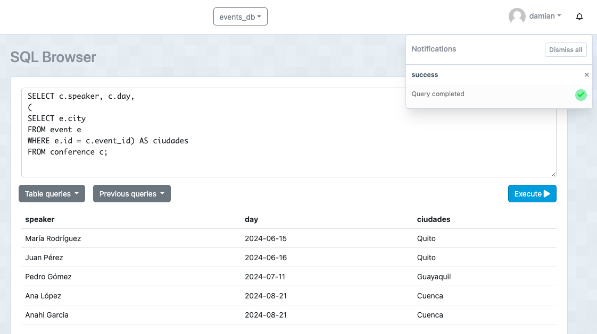

# Tarea en clases - Events

Damian Olivo

## 1. Consulta para seleccionar en las conferencias el expositor, dia y ciudad de eventos.

  - Sentencia:
 ```
  SELECT c.speaker, c.day, 
(
SELECT e.city
FROM event e
WHERE e.id = c.event_id) AS ciudades
FROM conference c;
  ```
  - Captura:



## 2. Consulta para seleccionar los nombres, email y asistencia de los miembros registrados .
  - Sentencia:
```
  SELECT m.full_name, m.email, 
(
SELECT r.assited
FROM register r
WHERE r.member_id = m.id ) AS asistencia 
FROM member m;
  ```
  - Captura:

